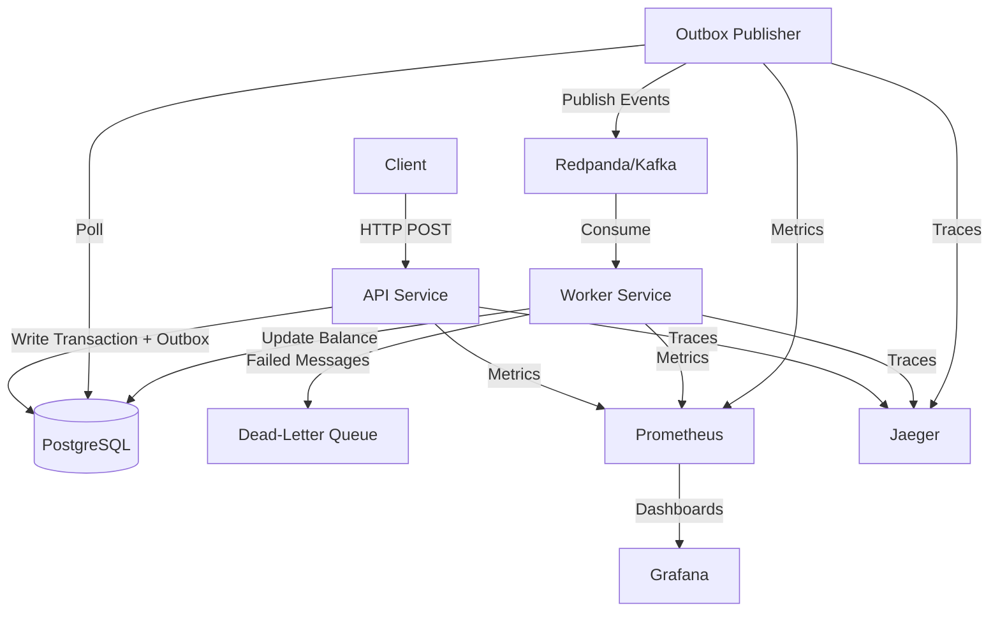

# Event-Driven Transaction Processing System

A an event-driven transaction processing system demonstrating enterprise-level distributed systems patterns including transactional outbox, idempotency, retries, dead-letter queues, and comprehensive observability. Built with Go, Kafka (Redpanda), PostgreSQL, and modern observability tooling.

## Overview

This system implements a simplified payments/orders transaction pipeline that processes financial transactions asynchronously with strong consistency guarantees. It demonstrates real-world patterns used at companies like Coinbase, Shopify, and DocuSign for handling high-throughput, reliable transaction processing.

**Key Features:**
- **Transactional Outbox Pattern**: Guarantees event publishing consistency with database state
- **Idempotent Processing**: Exactly-once effect semantics for transaction application
- **At-Least-Once Delivery**: Reliable message delivery with retry mechanisms
- **Dead-Letter Queue**: Handles permanently failed messages
- **Comprehensive Observability**: Metrics, structured logging, and distributed tracing
- **Production-Ready**: Health checks, graceful shutdown, timeouts, and error handling

## Architecture



### System Components

1. **API Service** (`api/`): REST API for creating accounts and transactions
   - Handles idempotency at API level
   - Writes transactions and outbox events in a single DB transaction
   - Exposes health and metrics endpoints

2. **Outbox Publisher** (`publisher/`): Background service that publishes outbox events
   - Polls `outbox_events` table for pending events
   - Publishes to Kafka with transaction guarantees
   - Marks events as published after successful delivery

3. **Worker Service** (`worker/`): Event consumer that processes transactions
   - Consumes `transaction.created` events from Kafka
   - Applies idempotent ledger updates
   - Implements retry with exponential backoff
   - Sends failed messages to DLQ after max retries

4. **Shared Libraries** (`shared/`): Common code for all services
   - Types and data models
   - Database connection management
   - Configuration loading
   - OpenTelemetry tracing setup

## Reliability Guarantees

### At-Least-Once Delivery
- Kafka consumer commits offsets only after successful processing
- Failed messages are retried with exponential backoff
- Messages are never lost (unless explicitly sent to DLQ)

### Exactly-Once Effect (Idempotency)
- **API Level**: Same `(account_id, idempotency_key)` returns the same transaction
- **Consumer Level**: `processed_events` table ensures events are only processed once
- Database constraints prevent duplicate processing

### Transactional Consistency
- Outbox pattern ensures events are only published after DB transaction commits
- Account balance updates are atomic with transaction status updates
- Row-level locking prevents race conditions

## How It Works

### Creating a Transaction

1. Client sends `POST /v1/transactions` with idempotency key
2. API checks for existing transaction with same `(account_id, idempotency_key)`
3. If new, API:
   - Inserts transaction row (status: PENDING)
   - Inserts outbox event row (status: PENDING)
   - Commits transaction atomically
4. Returns transaction immediately (async processing)

### Publishing Events

1. Publisher polls `outbox_events` table every 5 seconds
2. Fetches pending events (with `FOR UPDATE SKIP LOCKED`)
3. Publishes each event to Kafka topic `transactions`
4. Marks event as PUBLISHED in database

### Processing Transactions

1. Worker consumes `transaction.created` events from Kafka
2. Checks `processed_events` table for idempotency
3. In a single DB transaction:
   - Inserts into `processed_events` (idempotency check)
   - Locks account row (`FOR UPDATE`)
   - Validates business rules (e.g., sufficient balance)
   - Updates account balance
   - Updates transaction status to PROCESSED or FAILED
4. Commits transaction
5. On failure: retries with exponential backoff (max 5 attempts)
6. After max retries: sends to DLQ topic `transactions.dlq`

## Observability

### Metrics (Prometheus)

- `http_requests_total`: API request count by method, route, status
- `http_request_duration_seconds`: API latency histogram
- `events_consumed_total`: Events consumed by type and status
- `worker_processing_duration_seconds`: Worker processing time
- `worker_retries_total`: Retry count by event type
- `dlq_messages_total`: Messages sent to DLQ

### Logging

Structured JSON logs with correlation fields:
- `service`: Service name
- `request_id`: Request correlation ID
- `trace_id`: Distributed trace ID
- `event_id`: Event identifier
- `transaction_id`: Transaction identifier
- `account_id`: Account identifier

### Tracing (Jaeger)

OpenTelemetry instrumentation across:
- API request handling
- Outbox event publishing
- Worker event processing
- Database operations

### Dashboards (Grafana)

Access Grafana at `http://localhost:3000` (admin/admin):
- API request rate and latency (p95)
- Worker throughput and processing time
- DLQ message volume
- Error rates by service

## Quick Start

### Prerequisites

- **Docker and Docker Compose** (required)
- **Go 1.22+** (optional, for local development)
- **Make** (optional, for convenience)

**Note:** Docker builds automatically download dependencies. For local development, install Go and run `go mod tidy`.

### Run Locally

1. **Start all services:**
   ```bash
   make up
   # or
   docker compose -f infra/docker-compose.yml up --build
   ```

2. **Wait for services to be ready** (about 30 seconds)

3. **Verify services:**
   - API: http://localhost:8080/health
   - Grafana: http://localhost:3000 (admin/admin)
   - Prometheus: http://localhost:9090
   - Jaeger: http://localhost:16686

4. **Seed sample data:**
   ```bash
   make seed
   ```

### Testing

```bash
# Run E2E tests (requires services to be running)
make e2e

# Run all tests
make test
```

## Data Model

### Accounts
- `id` (UUID, PK)
- `currency` (TEXT)
- `balance_cents` (BIGINT)
- `status` (ACTIVE | SUSPENDED)

### Transactions
- `id` (UUID, PK)
- `account_id` (UUID, FK)
- `amount_cents` (BIGINT)
- `currency` (TEXT)
- `type` (DEBIT | CREDIT)
- `status` (PENDING | PROCESSING | PROCESSED | FAILED)
- `idempotency_key` (TEXT)
- `failure_reason` (TEXT, nullable)
- Unique constraint: `(account_id, idempotency_key)`

### Outbox Events
- `id` (UUID, PK)
- `aggregate_type` (TEXT)
- `aggregate_id` (UUID)
- `event_type` (TEXT)
- `payload` (JSONB)
- `status` (PENDING | PUBLISHED)
- `publish_attempts` (INT)
- `last_error` (TEXT, nullable)

### Processed Events
- `event_id` (UUID, PK) - for idempotent consumption
- `transaction_id` (UUID, FK)
- `processed_at` (TIMESTAMP)

## Production Improvements

This is a demonstration system. For production use, consider:

### Infrastructure
- **Schema Registry**: For Kafka message schema evolution
- **Multi-Region**: Active-active or active-passive deployment
- **Partitioning Strategy**: Scale Kafka partitions based on account_id distribution
- **Database Replication**: Read replicas for scaling reads
- **Connection Pooling**: Tune pool sizes based on load

### Security
- **Authentication/Authorization**: OAuth2, JWT, or API keys per client
- **TLS/SSL**: Encrypt all inter-service communication
- **Secrets Management**: Use Vault, AWS Secrets Manager, or similar
- **Rate Limiting**: Per-client rate limits with Redis
- **Input Validation**: Comprehensive validation and sanitization

### Reliability
- **Saga Pattern**: For multi-step transactions across services
- **Circuit Breakers**: Prevent cascading failures
- **Bulkhead Pattern**: Isolate critical vs non-critical operations
- **Chaos Engineering**: Test failure scenarios
- **Backup & Recovery**: Regular database backups and disaster recovery plans

### Observability
- **Alerting**: Set up alerts for error rates, latency, DLQ volume
- **Log Aggregation**: Centralized logging (ELK, Loki, etc.)
- **Distributed Tracing**: Full request tracing across services
- **Business Metrics**: Track revenue, transaction volume, etc.

### Performance
- **Caching**: Redis cache for frequently accessed accounts
- **Batch Processing**: Optimize outbox publisher batch size
- **Database Indexing**: Add indexes based on query patterns
- **Connection Pooling**: Optimize DB and Kafka connection pools

### Operations
- **Blue-Green Deployments**: Zero-downtime deployments
- **Feature Flags**: Gradual feature rollouts
- **A/B Testing**: Test new features safely
- **Monitoring Runbooks**: Document incident response procedures

## Project Structure

```
.
├── api/              # REST API service
├── worker/           # Event consumer service
├── publisher/        # Outbox publisher service
├── shared/           # Shared libraries (types, config, DB, tracing)
├── infra/            # Infrastructure (Docker Compose, migrations, observability)
│   ├── docker-compose.yml
│   ├── migrations/
│   ├── prometheus/
│   └── grafana/
├── tests/            # Integration and E2E tests
└── Makefile
```

## License

MIT License - feel free to use this as a reference or starting point for your own projects.

## Contributing

This is a portfolio/demonstration project. For questions or improvements, please open an issue or submit a pull request.

